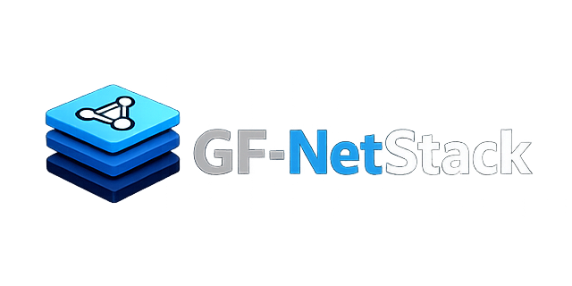

<p align="center">
  
</p>

## En cours de développement… / Currently in development…

---

<details>
  <summary>🇫🇷 Version Française</summary>

# SDK moderne, modulaire et extensible pour Fortran95 & PureBasic

---

## 📚 Table des matières

- [Introduction](#introduction)
- [Architecture](#architecture)
  - [Serveur TLS (C)](#serveur-tls-c)
  - [Client TLS (C)](#client-tls-c)
  - [Wrapper PureBasic](#wrapper-purebasic)
  - [Protocole JSON](#protocole-json)
- [Framing JSON](#framing-json)
- [Exemples PureBasic](#exemples-purebasic)
- [Sécurité](#sécurité)
- [Fonctionnalités actuelles](#fonctionnalités-actuelles)
- [Prochaines étapes](#prochaines-étapes)
- [Vision du Projet – GF NetStack](#vision-du-projet--gf-netstack)
  - [WebSocket sécurisé (WSS)](#1-websocket-sécurisé-wss)
  - [SMTP sécurisé (SMTPS)](#2-smtp-sécurisé-smtps)
  - [POP3 sécurisé (POP3S)](#3-pop3-sécurisé-pop3s)
  - [HTTPS minimaliste](#4-https-minimaliste)
  - [Bindings bases de données](#5-bindings-bases-de-données)
    - [SQLiteCloud](#sqlitecloud)
    - [PostgreSQL](#postgresql)
    - [MySQL / MariaDB](#mysql--mariadb)
    - [SQLite (local)](#sqlite-local)
  - [Modules PB & Fortran](#6-modules-pb--fortran-prêts-à-lemploi)
  - [Vision globale](#7-vision-globale)
- [CLI – Interface en ligne de commande](#cli--interface-en-ligne-de-commande)


---

# 🔐 Introduction
TLSv2 est une couche de communication sécurisée basée sur :

- TLS (OpenSSL)
- Un framing JSON robuste (4 bytes + UTF‑8)
- Un wrapper C stable
- Des bindings PureBasic fonctionnels
- Une architecture prête pour Fortran, Lua, PB, C, etc.

Objectif : fournir une base solide pour créer des protocoles applicatifs sans se battre avec TLS ou les buffers.

---

# 🧱 Architecture

## Serveur TLS (C)
- Non‑bloquant  
- Multi‑clients  
- Basé sur `select()`  
- Handshake TLS automatique  
- Callbacks : `on_client_connected`, `on_client_disconnected`, `on_json_received`

## Client TLS (C)
- Bloquant  
- `tlsv2_client_send_json()`  
- `tlsv2_client_recv_json()`  

## Wrapper PureBasic
- Import direct du `.so/.dll/.dylib`
- Callbacks PB → C
- `ReceiveJSON()` sécurisé

## Protocole JSON
| Type | Description |
|------|-------------|
| `"text"` | Messages texte |
| `"command"` | Commandes (PING → PONG) |
| `"table"` | Réponses tabulaires |

---

# 📡 Framing JSON

```
[4 bytes length][JSON UTF‑8 payload]
```

- Longueur = uint32 big‑endian  
- UTF‑8 propre  
- Compatible tous langages

---

# 🧪 Exemples PureBasic

## Serveur PB
- Dispatch automatique  
- Réponses TEXT, PING/PONG, TABLE

## Client PB
- Envoie TEXT → reçoit réponse  
- Envoie PING → reçoit PONG  
- Envoie TABLE → reçoit données  

---

# 🔒 Sécurité
- TLS 1.2+  
- Certificat PEM  
- Fermeture propre (SSL_shutdown)

---

# ✔ Fonctionnalités actuelles
- Serveur TLS multi‑clients  
- Client TLS stable  
- Framing JSON robuste  
- PureBasic serveur + client  
- PING/PONG  
- TEXT → reply  
- TABLE → données  
- Buffers synchronisés  
- Aucun crash  
- `.gitattributes` propre  

---

# 🚧 Prochaines étapes
- Bindings Fortran  
- Module PB “TLSv2Client”  
- Authentification  
- Gestion d’erreurs JSON  
- Intégration SQLite réelle  
- Documentation bilingue  

---

# 🌐 Vision du Projet – GF NetStack

## 1. WebSocket sécurisé (WSS)
- Handshake WebSocket  
- Frames texte/binaire  
- Ping/Pong natif  

## 2. SMTP sécurisé (SMTPS)
- Envoi d’e‑mails  
- Auth LOGIN / PLAIN  
- MIME  

## 3. POP3 sécurisé (POP3S)
- Récupération d’e‑mails  
- Listing / téléchargement / suppression  

## 4. HTTPS minimaliste
- GET / POST / PUT / DELETE  
- JSON intégré  

## 5. Bindings bases de données

### SQLiteCloud
- Connexion distante  
- Tables JSON  

### PostgreSQL
- TLS  
- Requêtes préparées  
- JSONB  

### MySQL / MariaDB
- TLS  
- Requêtes simples  

### SQLite (local)
- Fichier `.db`  
- Requêtes SQL  
- Tables JSON  
- Requêtes préparées  

## 6. Modules PB & Fortran prêts à l’emploi
- `GF.Net.TLSv2`  
- `GF.Net.WebSocket`  
- `GF.Net.SMTP`  
- `GF.Net.POP3`  
- `GF.Net.HTTP`  
- `GF.DB.SQLiteCloud`  
- `GF.DB.PostgreSQL`  
- `GF.DB.MySQL`  
- `GF.DB.SQLite`  

## 7. Vision globale
Créer un SDK réseau complet, moderne, sécurisé, modulaire.

---

# CLI – Interface en ligne de commande
*(Ne fonctionne pas actuellement)*

Commandes :  
`doctor`, `new`, `build`, `clean`, `run`

---


</details>

---

<details>
  <summary>🇬🇧 English Version</summary>

# Modern, modular and extensible SDK for Fortran95 & PureBasic

---

## 📚 Table of Contents

- [Introduction](#introduction-1)
- [Architecture](#architecture-1)
  - [TLS Server (C)](#tls-server-c)
  - [TLS Client (C)](#tls-client-c)
  - [PureBasic Wrapper](#purebasic-wrapper)
  - [JSON Protocol](#json-protocol)
- [JSON Framing](#json-framing)
- [PureBasic Examples](#purebasic-examples)
- [Security](#security)
- [Current Features](#current-features)
- [Next Steps](#next-steps)
- [Project Vision – GF NetStack](#project-vision--gf-netstack)
  - [Secure WebSocket (WSS)](#1-secure-websocket-wss)
  - [Secure SMTP (SMTPS)](#2-secure-smtp-smtps)
  - [Secure POP3 (POP3S)](#3-secure-pop3-pop3s)
  - [Minimal HTTPS Client](#4-minimal-https-client)
  - [Database Bindings](#5-database-bindings)
    - [SQLiteCloud](#sqlitecloud-1)
    - [PostgreSQL](#postgresql-1)
    - [MySQL / MariaDB](#mysql--mariadb-1)
    - [SQLite (local)](#sqlite-local-1)
  - [PB & Fortran Modules](#6-ready-to-use-pb--fortran-modules)
  - [Global Vision](#7-global-vision)
- [CLI – Command Line Interface](#cli--command-line-interface)


---

# 🔐 Introduction
TLSv2 is a secure communication layer built on:

- TLS (OpenSSL)
- Robust JSON framing
- Clean C wrapper
- PureBasic bindings
- Fortran/Lua/PB/C ready

---

# 🧱 Architecture

## TLS Server (C)
Non‑blocking, multi‑client, callbacks.

## TLS Client (C)
Blocking, simple, stable.

## PureBasic Wrapper
Direct import, safe JSON receive.

## JSON Protocol
TEXT, COMMAND, TABLE.

---

# 📡 JSON Framing

```
[4 bytes length][JSON UTF‑8 payload]
```

---

# 🧪 PureBasic Examples
Server + client examples included.

---

# 🔒 Security
TLS 1.2+, PEM certs.

---

# ✔ Current Features
Stable TLS, JSON framing, PB examples, no crashes.

---

# 🚧 Next Steps
Fortran bindings, PB module, SQLite, auth, docs.

---

# 🌐 Project Vision – GF NetStack

## 1. Secure WebSocket (WSS)
Handshake, frames, ping/pong.

## 2. Secure SMTP (SMTPS)
Email sending, MIME.

## 3. Secure POP3 (POP3S)
Email retrieval.

## 4. Minimal HTTPS Client
REST‑friendly.

## 5. Database Bindings
SQLiteCloud, PostgreSQL, MySQL/MariaDB, SQLite local.

## 6. PB & Fortran Modules
Unified API.

## 7. Global Vision
Complete, modern, secure SDK.

---

# CLI – Command Line Interface
Commands: doctor, new, build, clean, run.

---


</details>

---

## 👤 Auteur / Author  
**Guillaume Foisy**  
Passionné par la modernisation de l’écosystème Fortran95 & PureBasic  


---
